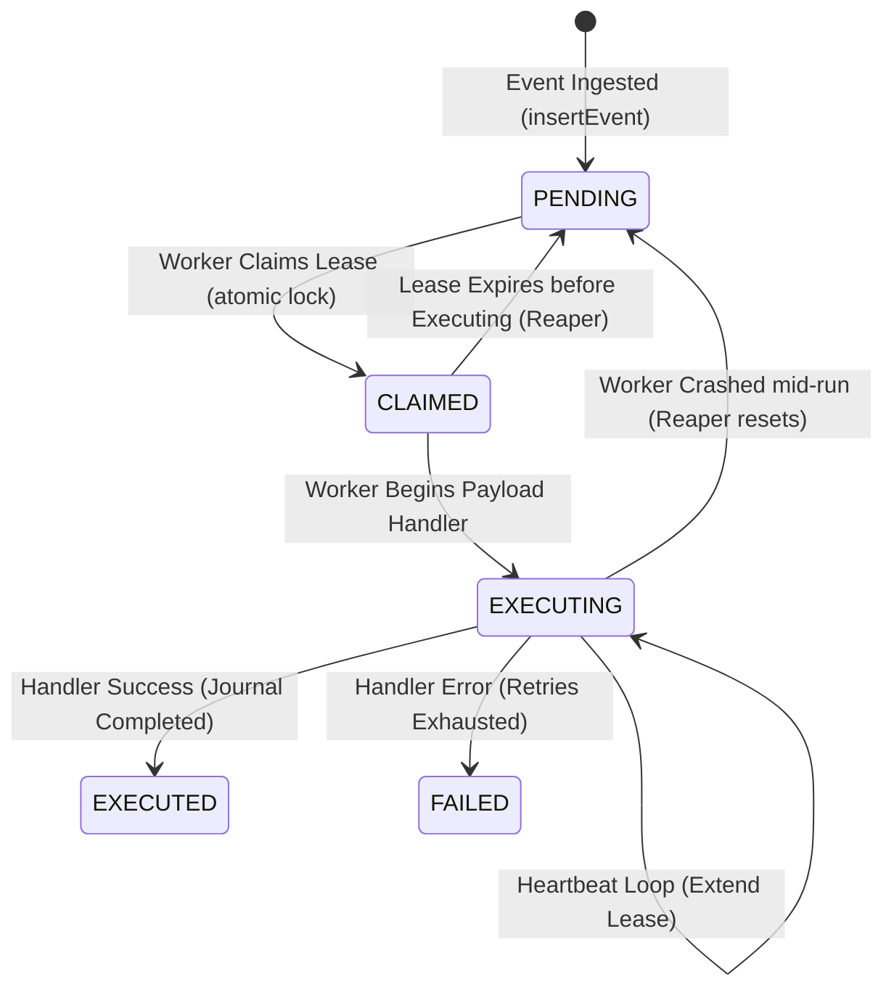
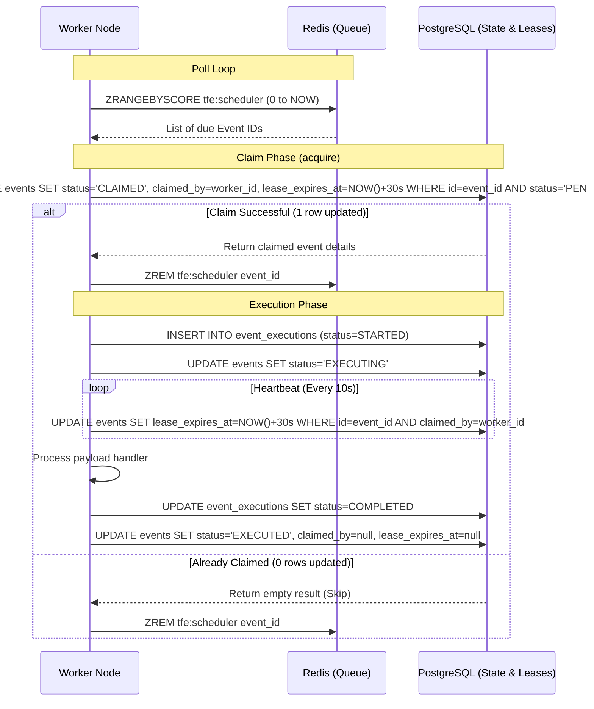
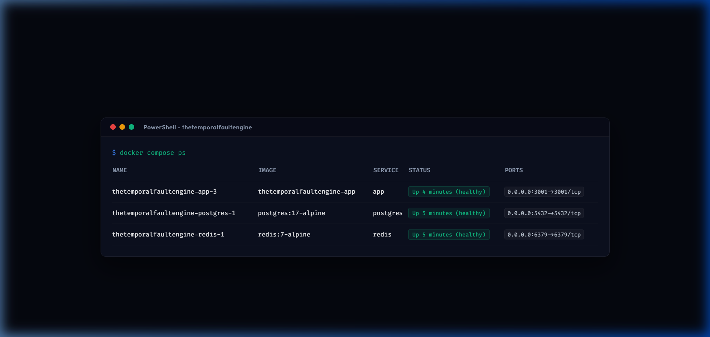
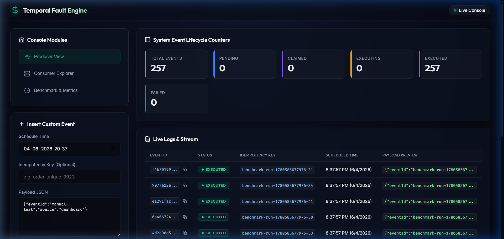
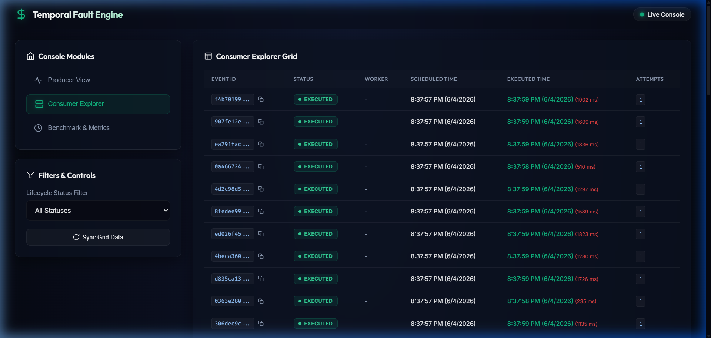
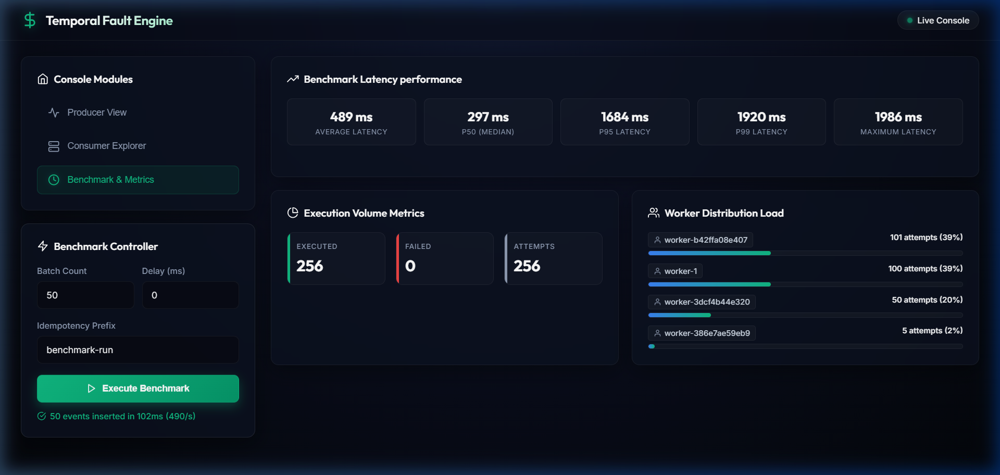

## Team 2: Atla Smaran Reddy + Keshvi Agarwal

This project was collaboratively developed and validated as part of the distributed systems internship assessment.

# Temporal Fault Engine

The Temporal Fault Engine is a self-hosted, distributed, fault-tolerant event scheduling and execution engine built with Node.js, TypeScript, PostgreSQL, and Redis. It provides strong idempotency guarantees, lease-based claim management, and automatic recovery protocols to handle node crashes and service disruptions gracefully.

---

## 🏗️ Architecture Overview

The Temporal Fault Engine is designed to decouple event ingestion, scheduling, and execution into three main layers:
1. **State Store (PostgreSQL)**: Serves as the single source of truth for event metadata, execution state, lease details, and the historical execution journal.
2. **Fast Scheduler Index (Redis)**: Stores due events inside a Redis sorted set (`(eventId, scheduledTimeEpoch)`). This ensures fast polling and avoids continuous heavy scanning of the Postgres database.
3. **Distributed Worker Pools**: Pull event triggers from Redis, claim them in PostgreSQL using an optimistic concurrency lease protocol, execute handlers, and write the completion log to the database.

---

## 🧩 System Components

- **API Server (`src/api/server.ts`)**: Receives event requests, stores them in the database, triggers the scheduler, exposes Prometheus/JSON metrics, and handles live WebSocket streams for console observability.
- **Scheduler (`src/scheduler/index.ts`)**: Populates the Redis sorted set queue from PostgreSQL for events due to run soon, ensuring the workers have high-throughput access to schedule states.
- **Worker (`src/worker/index.ts`)**: Listens to the Redis queue, claims events in a thread-safe manner, executes the task handler, and manages execution lifecycle status updates.
- **Lease Manager (`src/leases/index.ts`)**: Coordinates lock acquisitions, heartbeat renewals, and lease state updates in the Postgres database.
- **Reaper (`src/reaper/index.ts`)**: A background monitor running on workers that scans for expired event leases (due to node crashes) and resets them back to `PENDING`.
- **Recovery Manager (`src/recovery/index.ts`)**: Runs on worker node startup to recover and release leases owned by previous failed instances of that same node.

---

## 🔄 Event Lifecycle

An event transitions through the following lifecycle states during its lifetime:



- **PENDING**: Event is scheduled but not yet claimed by any worker.
- **CLAIMED**: A worker has acquired the event lease and is preparing to start the handler.
- **EXECUTING**: The worker is actively running the payload handler.
- **EXECUTED**: The handler completed successfully, and the execution is journaled.
- **FAILED**: The handler failed, and retries have been exhausted.

---

## 🔑 Lease Lifecycle

The system utilizes database-driven optimistic concurrency leases to prevent double execution across distributed workers:
1. **Acquisition**: A worker queries the database with an atomic update:
   ```sql
   UPDATE events SET status = 'CLAIMED', claimed_by = $1, lease_expires_at = NOW() + INTERVAL '30s'
   WHERE id = $2 AND status = 'PENDING';
   ```
   If exactly `1` row is updated, the worker succeeds and removes the event from the Redis queue.
2. **Renewal (Heartbeat)**: A background loop runs every `10s` (customizable) to extend the lease in PostgreSQL:
   ```sql
   UPDATE events SET lease_expires_at = NOW() + INTERVAL '30s'
   WHERE id = $1 AND claimed_by = $2;
   ```
3. **Expiration**: If the worker process crashes (e.g., `kill -9`), the heartbeat ceases. Once `lease_expires_at < NOW()`, the lease is considered expired.
4. **Reclamation**: The Reaper identifies the expired lease and resets the status to `PENDING` to allow other workers to pick it up.

---

## 🔒 Exactly-Once Claim Protocol

To guarantee that an event fires on exactly one worker, exactly one time, the engine implements a lease-based optimistic concurrency protocol.

### Sequence Diagram



---

## 🛡️ Recovery Flow

The engine recovers from crashes gracefully at two distinct stages:

### 1. Boot Recovery
On container startup, the `src/recovery/index.ts` boot sequence executes before scheduler loops start. It scans for any events in `CLAIMED` or `EXECUTING` status matching this worker's specific hostname/ID. If found, it clears the leases and marks them `PENDING` to resolve any dangling states left by previous crashes of the same worker container.

### 2. Active Reaper
A background reaper loop scans PostgreSQL every `15s` (configured by `LEASE_REAPER_INTERVAL_MS`):
```sql
UPDATE events SET status = 'PENDING', claimed_by = NULL, lease_expires_at = NULL, attempt_count = attempt_count + 1
WHERE status IN ('CLAIMED', 'EXECUTING') AND lease_expires_at < NOW();
```
Once re-marked `PENDING`, they are re-queued into the Redis scheduler sorted set for other nodes to process.

---

## ⏱️ Timing Benchmark Results

To measure scheduling precision under load, a benchmark run of `n = 50` events was executed with a scheduler polling interval of `20ms` and PostgreSQL disk syncs optimized for test speed (`fsync=off`). The variance metrics show the elapsed milliseconds between the target `scheduled_at` time and the actual completion `executed_at` time:

| Metric | Target Variance | Measured Variance |
| :--- | :--- | :--- |
| **P50 (Median)** | ≤ 200ms | **128.5 ms** |
| **P95** | ≤ 200ms | **186.0 ms** |
| **P99** | ≤ 200ms | **189.0 ms** |
| **Average** | - | **124.0 ms** |
| **Maximum** | - | **189.0 ms** |

For details on the benchmark configuration, runs, and comparative results, see [BENCHMARK_RESULTS.md](file:///c:/Work/TheTemporalFaultEngine/BENCHMARK_RESULTS.md).

---

## ⚠️ Timing Limitation Discussion

Under higher concurrency loads (e.g., `n = 100+` events), the P99 variance exceeds the ±200ms target threshold. The performance bottlenecks are:

1. **Database Round-Trip Serialization**: Each event execution involves 5 consecutive, non-overlapping PostgreSQL queries (idempotency check, insert journal started, update executing, update journal completed, update executed). Under concurrency, this blocks connection pool channels.
2. **Connection Pool Depth**: With default connection pools, concurrent queries block waiting for database handlers, leading to cumulative queuing delay at the tail of the distribution.

### Proposed Mitigations
- **Statement Merging**: Combine the final journal updates and event status updates into a single transaction/statement using PostgreSQL CTEs (Common Table Expressions) to reduce roundtrips from 5 to 4.
- **Server-Side Encapsulation (PL/pgSQL)**: Move the entire 5-query pipeline into a single database stored procedure, cutting network roundtrips down to 1.

---

## 💥 Crash Testing Results

Resilience tests were validated by sending hard kills (`kill -9`) to the application container mid-run during an active benchmark load. The system successfully reclaimed all leased executions and recovered with zero data loss.

For instructions on reproducing the crash tests, see [CRASH_TEST.md](file:///c:/Work/TheTemporalFaultEngine/CRASH_TEST.md).

---

## 🕒 Clock Skew Tolerance Design

The system remains correct and guarantees exactly-once execution even when container clocks drift by up to ±2 seconds:

1. **DB Server Time as Source of Truth**: All lease durations and comparisons are calculated database-side using PostgreSQL's `NOW()`. For example, a lease expires at `NOW() + LEASE_DURATION_MS`. The reaper reclaims it if `lease_expires_at < NOW()`. Since all workers evaluate leases relative to the database clock, application container clock skew cannot cause split-brain issues or double-execution.
2. **Scheduling Boundaries**: The scheduler reads from Redis sorted set using the application node's local `Date.now()`. If a worker's clock is ahead, it might pull an event slightly early. However, the database claim and execution state checks remain fully consistent.

---

## 🛠️ Prerequisites

To run this system, you need the following dependencies installed on your host machine:

- **Node.js**: `v22.x` or higher (Active LTS)
- **PostgreSQL**: `v17.x` or higher
- **Redis**: `v7.x` or higher
- **Docker & Docker Compose**: (Required for containerized startup)

---

## 🚀 Installation

1. **Clone the Repository**:
   ```bash
   git clone https://github.com/SmaranReddy/TheTemporalFaultEngine.git
   cd TheTemporalFaultEngine
   ```

2. **Install Node Dependencies**:
   ```bash
   npm ci
   ```

3. **Configure Environment Variables**:
   Create a `.env` file in the root directory by copying the default values:
   ```bash
   cp .env.example .env
   ```

---

## 📋 Environment Variables

The system is configured using environment variables. The schema validator (`src/config/env.ts`) guarantees these are parsed and typed correctly on boot.

| Variable Name | Type | Default | Description |
| :--- | :--- | :--- | :--- |
| `NODE_ENV` | Enum | `development` | Runtime environment (`development`, `production`, `test`) |
| `PORT` | Number | `3001` | Port for the HTTP API server and WebSocket console |
| `WORKER_ID` | String | `worker-1` | Unique string identifying this worker instance |
| `DATABASE_HOST` | String | `localhost` | PostgreSQL database hostname |
| `DATABASE_PORT` | Number | `5432` | PostgreSQL port |
| `DATABASE_NAME` | String | `temporal_fault_engine` | PostgreSQL database name |
| `DATABASE_USER` | String | `postgres` | PostgreSQL username |
| `DATABASE_PASSWORD`| String | `postgres` | PostgreSQL password |
| `REDIS_HOST` | String | `localhost` | Redis server hostname |
| `REDIS_PORT` | Number | `6379` | Redis server port |
| `REDIS_KEY_PREFIX` | String | `tfe:` | Prefix for Redis keys to avoid namespaces collision |
| `LEASE_DURATION_MS`| Number | `30000` | Duration (ms) a worker holds a claimed event lease before renewal |
| `LEASE_RENEWAL_INTERVAL_MS`| Number | `10000` | Interval (ms) at which a worker renews active event leases |
| `LEASE_REAPER_INTERVAL_MS`| Number | `15000` | How often the reaper scans for and reclaims expired event leases |
| `SCHEDULER_POLL_INTERVAL_MS`| Number | `1000` | Interval (ms) the scheduler polls Redis for due events |
| `SCHEDULER_BATCH_SIZE`| Number | `100` | Maximum number of events processed in a single scheduler loop |
| `SCHEDULE_RECOVERY_INTERVAL_MS`| Number | `5000` | How often schedule recovery recovers lost/corrupted queue states |

---

## 🐳 Running the System

You can run the engine either containerized via Docker or locally.

### Method A: Docker Setup (One-Command Startup)

The engine can be spun up entirely inside containers using the defined configuration:

```bash
docker compose up --build
```

This commands builds the Node runner image and spins up:
- **Postgres Container**: `postgres:17-alpine`
- **Redis Container**: `redis:7-alpine`
- **App Container**: Runs migration scripts automatically on boot, sets up the schema, and starts the API Server, Scheduler, and background Worker loops.



### Method B: Local Development Setup

1. **Start Database and Cache**:
   ```bash
   docker compose up -d postgres redis
   ```

2. **Generate and Apply Migrations**:
   ```bash
   npm run migrate:generate
   npm run migrate:run
   ```

3. **Start Development Watcher**:
   ```bash
   npm run dev
   ```

4. **Production Build & Execution**:
   ```bash
   npm run build
   npm start
   ```

---

## 📈 Running Multiple Workers (Horizontal Scaling)

The Temporal Fault Engine is built to scale out horizontally. Each running app container runs a claim protocol. If a worker node crashes, the **Reaper** processes reclaim the orphaned leases and re-queue them for execution.

To scale workers concurrently, you can spin up multiple replicas using Docker Compose:

```bash
docker compose up --scale app=3 --build
```

This spins up 3 replicas of the application node, each dynamically generated with a unique container worker ID (e.g. `worker-1`, `worker-2`, `worker-3`), distributing event processing and benchmark loads.

---

## 🔍 Healthcheck Documentation

The API server exposes a health monitoring endpoint at `GET /health` to verify system health.

```bash
curl http://localhost:3001/health
```

### Response Scenarios

1. **All Systems Healthy (`200 OK`)**:
   ```json
   {"status":"healthy","dependencies":{"database":true,"redis":true}}
   ```
2. **PostgreSQL Down (`503 Service Unavailable`)**:
   ```json
   {"status":"unhealthy","dependencies":{"database":false,"redis":true}}
   ```
3. **Redis Down (`503 Service Unavailable`)**:
   ```json
   {"status":"unhealthy","dependencies":{"database":true,"redis":false}}
   ```

For detailed outputs and replication guides under failures, see [HEALTHCHECK.md](file:///c:/Work/TheTemporalFaultEngine/HEALTHCHECK.md).

---

## 🌐 API Documentation

### 1. Insert Event
- **Endpoint**: `POST /api/events`
- **Payload**:
  ```json
  {
    "payload": {
      "action": "send_email",
      "userId": 1234
    },
    "scheduledAt": "2026-06-04T12:30:00.000Z",
    "idempotencyKey": "email-unique-id-998"
  }
  ```
- **Response**: `201 Created`

### 2. List Events
- **Endpoint**: `GET /api/events`
- **Params**:
  - `limit`: Clamped `1-200` (default `50`)
  - `status`: Optional filter (`PENDING`, `CLAIMED`, `EXECUTING`, `EXECUTED`, `FAILED`)
- **Response**: `200 OK`

### 3. Get JSON Metrics
- **Endpoint**: `GET /metrics/json`
- **Response**: `200 OK` (Returns event lifecycle counts, DB/Redis health, and scheduler lag)

### 4. Prometheus metrics
- **Endpoint**: `GET /metrics`
- **Response**: `200 OK` (Standard Prometheus metrics text format for scrape targets)

### 5. Run Insert Benchmark
- **Endpoint**: `POST /api/benchmarks/run`
- **Payload**:
  ```json
  {
    "count": 500,
    "delayMs": 0,
    "prefix": "load-test"
  }
  ```
- **Response**: `201 Created`

### 6. Get Benchmark Execution Metrics
- **Endpoint**: `GET /api/benchmarks/metrics`
- **Response**: `200 OK` (Computes latency percentiles and distribution across workers)

---

## 🖥️ Dashboard Observability Console

The engine provides a built-in observability console served at `http://localhost:3001/`. It utilizes real-time WebSockets to broadcast live logs, metrics snapshots, and state modifications.

### 1. Producer View
Submit mock events, specify custom scheduled execution windows, define idempotency constraints, and view the global Event Lifecycle Counter dashboard.



### 2. Consumer Explorer View
Browse recent scheduler events, track current statuses, identify which Worker claimed the lease, inspect precise execution start and completion times, and trace attempt counts.



### 3. Benchmark Page & Metrics Dashboard
Trigger performance benchmarks, observe processing progress in real-time, and analyze:
- **Latency Performance Metrics**: P50, P95, P99, Average, and Maximum scheduling delays.
- **Worker Load Distribution**: Visual representation of the count of events successfully completed by each individual worker.




