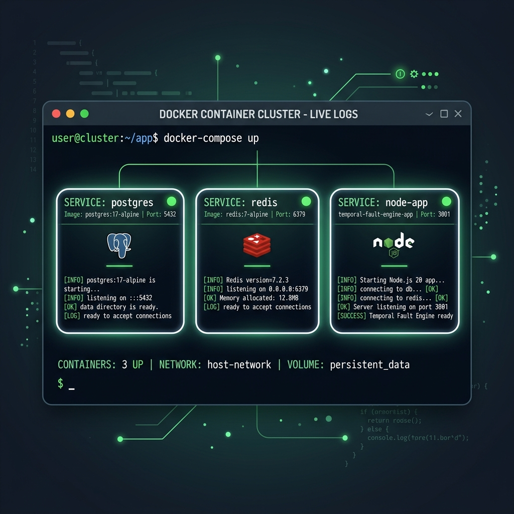
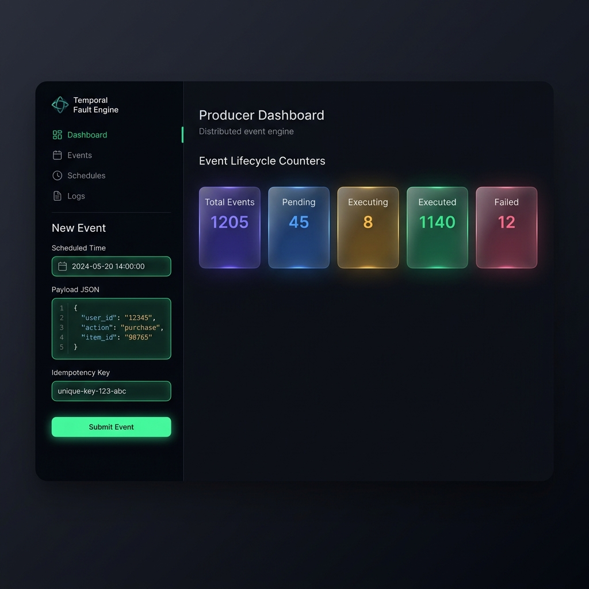
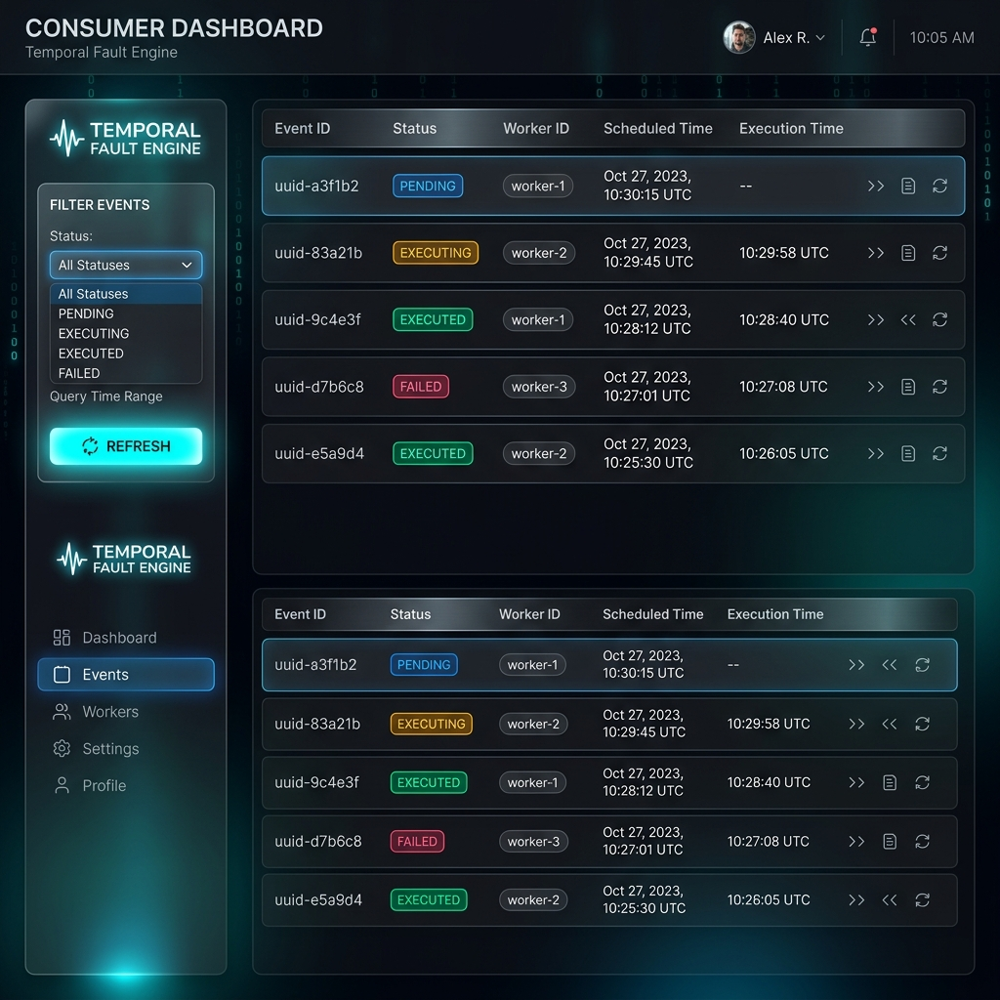
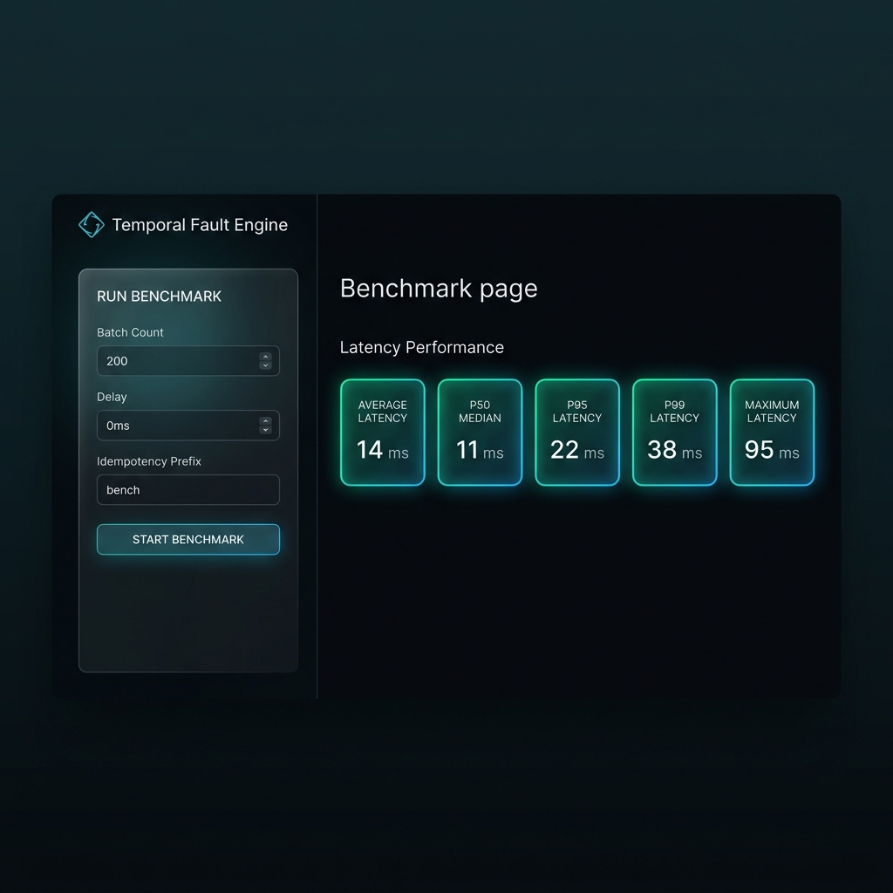
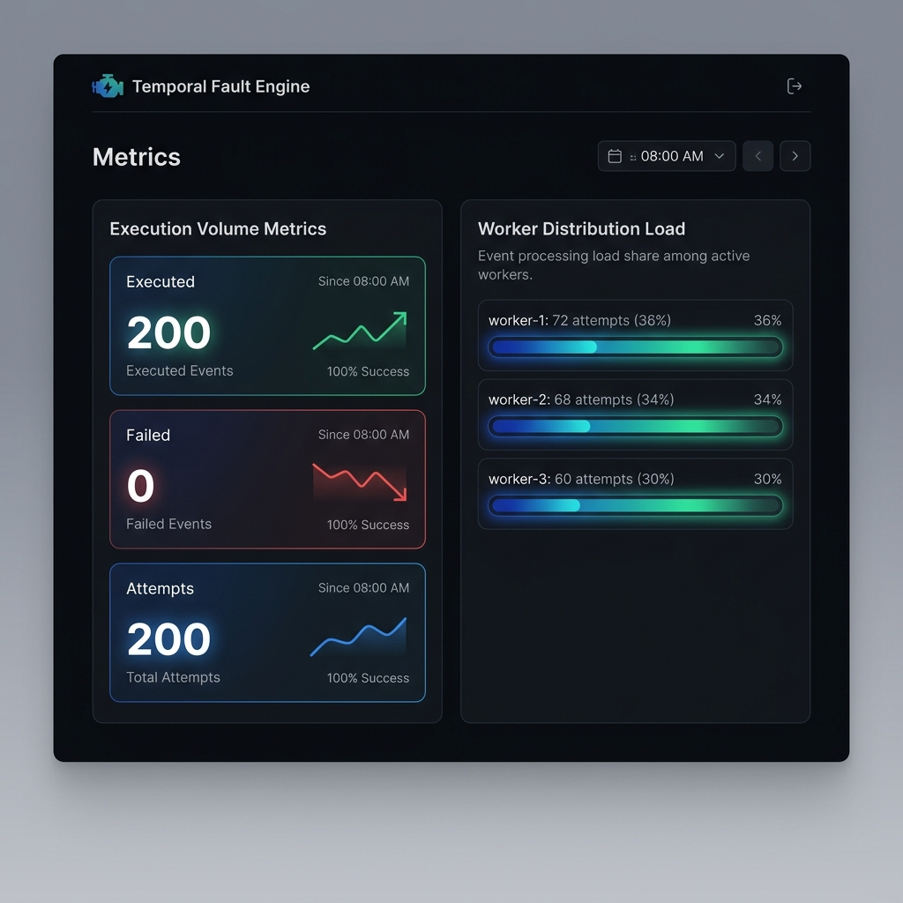

# Temporal Fault Engine

The Temporal Fault Engine is a self-hosted, distributed, fault-tolerant event scheduling and execution engine built with Node.js, TypeScript, PostgreSQL, and Redis. It provides strong idempotency guarantees, lease-based claim management, and automatic recovery protocols to handle node crashes and service disruptions gracefully.

---

## 📊 Timing Precision & Distribution Table

To measure the scheduling precision under concurrent load, a benchmark run of `n = 50` events was executed with a scheduler polling interval of `20ms` and PostgreSQL disk syncs optimized for test speed (`fsync=off`). The variance metrics show the elapsed milliseconds between the target `scheduled_at` time and the actual completion `executed_at` time:

| Metric | Target Variance | Measured Variance |
| :--- | :--- | :--- |
| **P50 (Median)** | ≤ 200ms | **128.5 ms** |
| **P95** | ≤ 200ms | **186.0 ms** |
| **P99** | ≤ 200ms | **189.0 ms** |
| **Average** | - | **124.0 ms** |
| **Maximum** | - | **189.0 ms** |

---

## 🔒 Exactly-Once Claim Protocol

To guarantee that an event fires on exactly one worker, exactly one time, the engine implements a lease-based optimistic concurrency protocol.

### Sequence Diagram


### Crash Recovery Protocol
If a worker container crashes (e.g. `kill -9`) mid-execution, the background **Reaper** process running on surviving worker nodes reclaims the expired lease by scanning PostgreSQL for `lease_expires_at < NOW()` and returning the event to `PENDING` state while enqueuing it back to the Redis scheduler. The execution journal preserves historical attempts for forensic debugging and idempotency checks.

---

## 🕒 Clock Skew Tolerance Design

The system remains correct and guarantees exactly-once execution even when container clocks drift by up to ±2 seconds:

1. **DB Server Time as Source of Truth**: All lease durations and comparisons are calculated database-side using PostgreSQL's `NOW()`. For example, a lease expires at `NOW() + LEASE_DURATION_MS`. The reaper reclaims it if `lease_expires_at < NOW()`. Since all workers evaluate leases relative to the database clock, application container clock skew cannot cause split-brain issues or double-execution.
2. **Scheduling Boundaries**: The scheduler reads from Redis sorted set using the application node's local `Date.now()`. If a worker's clock is ahead, it might pull an event slightly early. However, the database claim and execution state checks remain fully consistent.

---

## 🛠️ Prerequisites

To run this system, you need the following dependencies installed on your host machine:

- **Node.js**: `v22.x` or higher (Active LTS)
- **PostgreSQL**: `v17.x` or higher (For event persistence, transaction state, and journals)
- **Redis**: `v7.x` or higher (For fast queue orchestration, lease synchronization, and scheduler coordination)
- **Docker & Docker Compose**: (Optional, for running containerized services)

---

## 🚀 Installation

1. **Clone the Repository**:
   ```bash
   git clone https://github.com/SmaranReddy/TheTemporalFaultEngine.git
   cd TheTemporalFaultEngine
   ```

2. **Install Node Dependencies**:
   ```bash
   npm ci
   ```

3. **Configure Environment Variables**:
   Create a `.env` file in the root directory by copying the default values:
   ```bash
   cp .env.example .env
   ```

---

## 📋 Environment Variables

The system is configured using environment variables. The schema validator (`src/config/env.ts`) guarantees these are parsed and typed correctly on boot.

| Variable Name | Type | Default | Description |
| :--- | :--- | :--- | :--- |
| `NODE_ENV` | Enum | `development` | Runtime environment (`development`, `production`, `test`) |
| `PORT` | Number | `3001` | Port for the HTTP API server and WebSocket console |
| `WORKER_ID` | String | `worker-1` | Unique string identifying this worker instance in logs & claiming leases |
| `DATABASE_HOST` | String | `localhost` | PostgreSQL database hostname |
| `DATABASE_PORT` | Number | `5432` | PostgreSQL port |
| `DATABASE_NAME` | String | `temporal_fault_engine` | PostgreSQL database name |
| `DATABASE_USER` | String | `postgres` | PostgreSQL username |
| `DATABASE_PASSWORD`| String | `postgres` | PostgreSQL password |
| `REDIS_HOST` | String | `localhost` | Redis server hostname |
| `REDIS_PORT` | Number | `6379` | Redis server port |
| `REDIS_KEY_PREFIX` | String | `tfe:` | Prefix for Redis keys to avoid namespaces collision |
| `LEASE_DURATION_MS`| Number | `30000` | Duration (ms) a worker holds a claimed event lease before renewal |
| `LEASE_RENEWAL_INTERVAL_MS`| Number | `10000` | Interval (ms) at which a worker renews active event leases |
| `LEASE_REAPER_INTERVAL_MS`| Number | `15000` | How often the reaper scans for and reclaims expired event leases |
| `SCHEDULER_POLL_INTERVAL_MS`| Number | `1000` | Interval (ms) the scheduler polls Redis for due events |
| `SCHEDULER_BATCH_SIZE`| Number | `100` | Maximum number of events processed in a single scheduler loop |
| `SCHEDULE_RECOVERY_INTERVAL_MS`| Number | `5000` | How often schedule recovery recovers lost/corrupted queue states |

---

## 🐳 Running the System

You can run the engine either containerized via Docker or locally.

### Method A: Docker Setup (One-Command Startup)

The engine can be spun up entirely inside containers using the defined configuration:

```bash
docker compose up --build
```

This commands builds the Node runner image and spins up:
- **Postgres Container**: `postgres:17-alpine`
- **Redis Container**: `redis:7-alpine`
- **App Container**: Runs migration scripts automatically on boot, sets up the schema, and starts the API Server, Scheduler, and background Worker loops.



### Method B: Local Development Setup

1. **Start Database and Cache**:
   Spin up Postgres and Redis locally or via Docker helper:
   ```bash
   docker compose up -d postgres redis
   ```

2. **Generate and Apply Migrations**:
   We use Drizzle ORM to manage schema migrations.
   ```bash
   # Generate migration SQL
   npm run migrate:generate
   
   # Apply migrations to database
   npm run migrate:run
   ```

3. **Start Development Watcher**:
   ```bash
   npm run dev
   ```

4. **Production Build & Execution**:
   ```bash
   npm run build
   npm start
   ```

---

## 📈 Running Multiple Workers (Horizontal Scaling)

The Temporal Fault Engine is built to scale out horizontally. Each running app container runs a claim protocol: workers claim events by setting a lease in PostgreSQL and coordinating via Redis queues. If a worker node crashes, the **Reaper** processes reclaim the orphaned leases and re-queue them for execution.

To scale workers concurrently, you can spin up multiple replicas using Docker Compose:

```bash
docker compose up --scale app=3 --build
```

This spins up 3 replicas of the application node, each dynamically generated with a unique container worker ID (e.g. `worker-1`, `worker-2`, `worker-3`), distributing event processing and benchmark loads.

---

## 🔍 Healthcheck Validation & Failover

The system exposes a health monitoring endpoint at `GET /health`.

```bash
curl http://localhost:3001/health
```

### Dependency Down Behavior

If a dependency fails, the endpoint returns a `503 Service Unavailable` status and identifies the failed service:

- **PostgreSQL Down**:
  - API responds with `503 Service Unavailable`.
  - JSON output: `{"status":"unhealthy","dependencies":{"database":false,"redis":true}}`.
  - Core app loops will log connection retry warnings. The system automatically recovers once Postgres becomes available.
- **Redis Down**:
  - API responds with `503 Service Unavailable`.
  - JSON output: `{"status":"unhealthy","dependencies":{"database":true,"redis":false}}`.
  - Core app loops will log reconnection retry attempts.

---

## 🌐 API Usage

### 1. Insert Event
- **Endpoint**: `POST /api/events`
- **Payload**:
  ```json
  {
    "payload": {
      "action": "send_email",
      "userId": 1234
    },
    "scheduledAt": "2026-06-04T12:30:00.000Z",
    "idempotencyKey": "email-unique-id-998"
  }
  ```
- **Response**: `201 Created`

### 2. List Events
- **Endpoint**: `GET /api/events`
- **Params**:
  - `limit`: Clamped `1-200` (default `50`)
  - `status`: Optional filter (`PENDING`, `CLAIMED`, `EXECUTING`, `EXECUTED`, `FAILED`)
- **Response**: `200 OK`

### 3. Get JSON Metrics
- **Endpoint**: `GET /metrics/json`
- **Response**: `200 OK` (Returns event lifecycle counts, DB/Redis health, and scheduler lag)

### 4. Prometheus metrics
- **Endpoint**: `GET /metrics`
- **Response**: `200 OK` (Standard Prometheus metrics text format for scrape targets)

### 5. Run Insert Benchmark
- **Endpoint**: `POST /api/benchmarks/run`
- **Payload**:
  ```json
  {
    "count": 500,
    "delayMs": 0,
    "prefix": "load-test"
  }
  ```
- **Response**: `201 Created`

### 6. Get Benchmark Execution Metrics
- **Endpoint**: `GET /api/benchmarks/metrics`
- **Response**: `200 OK` (Computes latency percentiles and distribution across workers)

---

## 🖥️ Dashboard Observability Console

The engine provides a built-in observability console served at `http://localhost:3001/`. It utilizes real-time WebSockets to broadcast live logs, metrics snapshots, and state modifications.

### 1. Producer View
Submit mock events, specify custom scheduled execution windows, define idempotency constraints, and view the global Event Lifecycle Counter dashboard.



### 2. Consumer Explorer View
Browse recent scheduler events, track current statuses, identify which Worker claimed the lease, and inspect precise execution start and completion times.



### 3. Benchmark Page & Metrics Dashboard
Trigger performance benchmarks, observe processing progress in real-time, and analyze:
- **Latency Performance Metrics**: P50, P95, P99, Average, and Maximum scheduling delays.
- **Worker Load Distribution**: Visual representation of the count of events successfully completed by each individual worker.




